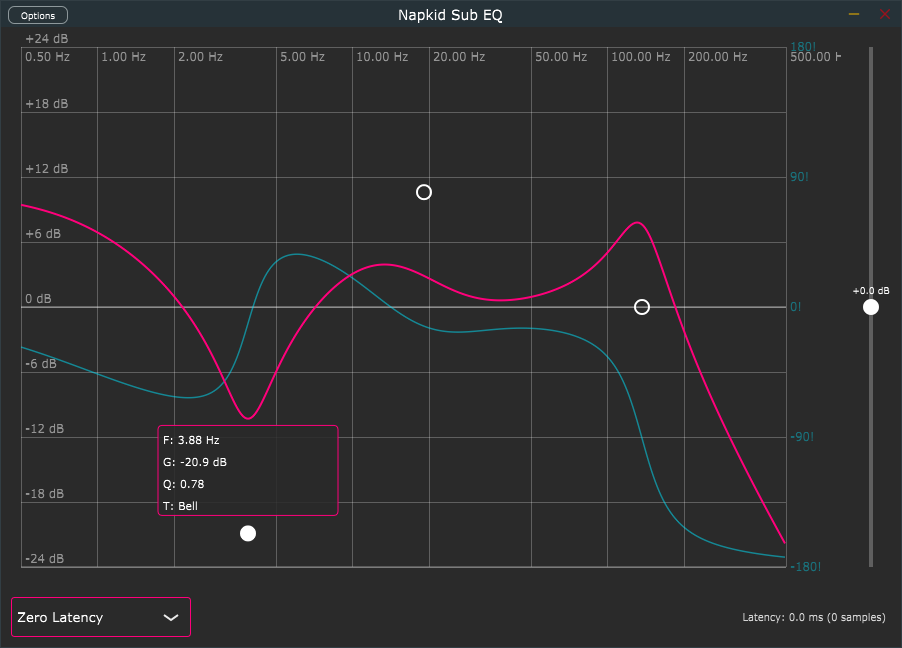

# Napkid Sub EQ

一款专为超低频而生的图形化参数均衡器 VST3 音频插件，精准调控 **0.5 Hz ~ 500 Hz** 频段。

---

## 概述

Napkid Sub EQ 是一款专为低频信号处理设计的参量均衡器插件。不同于市面上常见的全频段 EQ，它专注于 **0.5 Hz 至 500 Hz** 的核心低频范围，采用 **双精度 IIR Biquad** 滤波器架构，确保在极低频率下依然保持精确的系数计算和稳定的滤波响应。

特别适用于：
- 超低频声音设计
- 低频测量与校准
- 低频动态处理链中的 EQ 模块
- 直流/单极性控制信号的频响调节

---

## 界面预览



---

## 功能特性

- **8 节点参数 EQ**：每个节点独立控制频率、增益、Q 值和滤波器类型
- **8 种滤波器类型**：Bell、High Pass、Low Pass、Low Shelf、High Shelf、Notch、Tilt、Band Pass
- **±24 dB 增益范围**：满足极端的增益需求
- **双精度 IIR Biquad**：Direct Form II Transposed 结构，数值稳定
- **三种全局处理模式**（v0.2.0 新增）：
  - **Zero Latency（零延迟）**：纯 IIR 架构，无额外处理延迟
  - **Linear Phase（线性相位）**：基于 IIR 幅频响应设计严格线性相位 FIR（4096 点），固定延迟 2047 样本
  - **Minimum Phase（最小相位）**：基于 IIR 幅频响应设计最小相位 FIR（4096 点），通过 Cepstral 方法实现，延迟由最大群延迟动态计算
- **自动延迟补偿（PDC）**：模式切换或参数调整时自动向宿主报告延迟，支持 DAW 插件延迟补偿
- **实时延迟显示**：底部面板实时显示当前模式的延迟量（ms / samples）
- **实时相位响应曲线**：与幅频曲线同步显示（零延迟模式），非零延迟模式自动隐藏
- **实时频谱分析**：1/6 倍频程分辨率，8192 点 FFT，~60 fps 刷新率
- **便捷交互**：点击创建、拖拽移动、右击删除、滚轮调 Q（HP/LP/Notch/BP 上下拖动调 Q）
- **双击重置**：Bell/Shelf/Tilt 双击归零增益和 Q，HP/LP/Notch/BP 双击仅重置 Q
- **ASIO 支持**：低延迟音频接口兼容

---

## 技术规格

| 参数 | 规格 |
|------|------|
| 频率范围 | 0.5 Hz ~ 500 Hz |
| 增益范围 | -24 dB ~ +24 dB |
| Q 值范围 | 0.1 ~ 10.0 |
| 节点数量 | 8 个（独立开关） |
| 滤波器精度 | double (64-bit) |
| 频谱分辨率 | 1/6 倍频程（61 频段） |
| 频谱更新率 | ~60 fps |
| 频谱 FFT 大小 | 8192 点 |
| 频谱 FFT 跳步 | 512 样本 |
| FIR 长度 | 4096 点（Linear / Minimum Phase 模式） |
| 处理模式 | Zero Latency / Linear Phase / Minimum Phase |
| 处理延迟 | 0 ~ 2047 samples（依模式而定） |
| 支持格式 | VST3, Standalone |
| 窗口尺寸 | 900 × 620 像素 |
| 最低采样率 | 44100 Hz |

---

## 系统要求

- **操作系统**：Windows 10/11 (64-bit)
- **DAW**：任何支持 VST3 的宿主
- **编译器**：Visual Studio 2022
- **依赖**：JUCE 7.x 框架
- **可选**：ASIO SDK（用于 standalone 版本的 ASIO 支持）

---

## 构建说明

### 前置条件

1. 安装 [JUCE](https://juce.com/)（推荐 7.x 版本）
2. 安装 Visual Studio 2022（包含 C++ 桌面开发工作负载）
3. （可选）下载 [Steinberg ASIO SDK](https://www.steinberg.net/developers/) 并放置到项目引用路径

### 构建步骤

1. 使用 Projucer 打开 `Napkid Sub EQ.jucer`
2. 确认模块路径指向你的 JUCE modules 目录
3. 点击 **File → Save Project and Open in IDE**
4. 在 Visual Studio 中选择 **Release x64** 配置
5. 点击 **Build → Build Solution**

构建完成后，VST3 插件位于：
```
Builds/VisualStudio2022/x64/Release/VST3/
```

Standalone 可执行文件位于：
```
Builds/VisualStudio2022/x64/Release/Standalone Plugin/
```

---

## 使用指南

### 创建和编辑节点

| 操作 | 说明 |
|------|------|
| 左键点击空白区域 | 在点击位置创建新节点 |
| 左键拖拽节点 | 调节频率和增益（Bell/Shelf/Tilt）或频率和 Q（HP/LP/Notch/BP） |
| 右键点击节点 | 删除节点 |
| 滚轮（在节点上） | 调节 Q 值 |
| 双击节点 | 重置增益为 0 dB，Q 为 0.707（HP/LP/Notch/BP 只重置 Q） |
| Shift + 拖拽 | 仅调节频率 |
| Ctrl + 拖拽 | 仅调节增益（Bell/Shelf/Tilt）或仅调节 Q（HP/LP/Notch/BP） |

### 处理模式切换

底部面板提供处理模式选择：
- **Zero Latency**：纯 IIR 处理，零延迟，适合实时演奏和监听
- **Linear Phase**：严格线性相位 FIR，固定延迟 2047 样本，相位失真为零，适合母带处理
- **Minimum Phase**：最小相位 FIR，延迟动态计算，无预振铃（pre-ringing），适合一般混音使用

切换模式时插件会自动向宿主报告延迟，确保 DAW 的延迟补偿（PDC）正常工作。

### 节点参数标签

选中节点后显示浮动参数标签，可点击编辑：
- **F (Freq)**：频率值
- **G (Gain)**：增益值
- **Q**：Q 值
- **T (Type)**：滤波器类型（支持弹出菜单选择）

### 总增益控制

右侧面板为总增益推子，支持：
- 垂直拖拽调节总输出增益（-24 dB ~ +24 dB）
- 双击推子归零增益

---

## 项目结构

```
Sub EQ/
├── Source/
│   ├── PluginProcessor.h/.cpp       # 插件处理器主体
│   ├── PluginEditor.h/.cpp          # 插件编辑器入口
│   ├── SubEQ_Core.h/.cpp            # 双精度 Biquad EQ 引擎
│   ├── SubEQ_FFTProcessor.h/.cpp    # FIR 系数设计与卷积（Linear / Minimum Phase）
│   ├── SubEQ_Parameters.h           # APVTS 参数定义
│   ├── SubEQ_Spectrum.h/.cpp        # 实时频谱分析器
│   └── SubEQ_Editor/
│       ├── SubEQLookAndFeel.h       # 颜色主题和视觉常量
│       ├── FrequencyResponse.h/.cpp # 频响曲线绘制和节点交互
│       ├── MasterGainSlider.h/.cpp  # 总增益推子
│       └── ModeSelector.h/.cpp      # 底部模式选择面板（v0.2.0 新增）
├── Builds/VisualStudio2022/         # VS 项目生成目录（gitignored）
├── Napkid Sub EQ.jucer              # Projucer 项目文件
└── README.md                        # 本文件
```

---

## 相关文档

- **[更新日志](CHANGELOG.md)** — 查看所有版本的变更记录
- **[架构设计文档](Documentation/SubEQ_Architecture_Design.md)** — 深入了解 DSP 架构、GUI 设计和关键实现决策

---

## 关键技术决策

### 为什么使用 double 精度？

对于 0.5 Hz 的滤波器，归一化频率约为 1.04×10⁻⁵（@ 48 kHz）。在 float 精度下，三角函数计算和部分系数可能因舍入误差产生显著偏差，导致：
- 频率响应偏离设计值
- IIR 极点靠近或超出单位圆（不稳定）

双精度（64-bit）提供了约 15 位十进制精度，足以安全处理这些极端系数。

### 三种处理模式的设计考量

| 模式 | 延迟 | 相位特性 | 适用场景 |
|------|------|----------|----------|
| **Zero Latency** | 0 samples | 最小相位（IIR 固有） | 实时演奏、监听、低延迟要求 |
| **Linear Phase** | 2047 samples | 严格线性相位 | 母带处理、相位敏感操作 |
| **Minimum Phase** | 动态计算 | 最小相位（FIR 设计） | 混音、避免预振铃 |

- **Linear Phase** 使用频域采样 + IDFT 设计对称 FIR 系数，确保严格线性相位，但引入固定延迟和预振铃
- **Minimum Phase** 使用 Cepstral 方法从幅频响应提取最小相位 FIR，延迟由最大群延迟保守估计，无预振铃
- 两种 FIR 模式均基于当前 IIR 幅频响应设计，确保频响一致性

### 为什么是 0.5 Hz 起？

此插件设计目标之一是处理接近直流的控制信号。0.5 Hz 信号在 48 kHz 采样率下，一个完整周期横跨约 96,000 个样本（2 秒），提供了充足的数据来精确建模极低频行为。

---

## 已知限制

- **GUI 仅限 Windows**：当前使用 Projucer 的 VS2022 目标，GUI 渲染依赖 Windows GDI+
- **频谱下限**：FFT bin 分辨率限制了 500 Hz 以下的精细频谱显示（8192 点 FFT @ 48 kHz 约 5.86 Hz/bin）

---

## 依赖与许可

本项目基于以下第三方技术栈构建，各组件的许可信息如下：

### 核心框架

- **[JUCE](https://juce.com/)**
  - Copyright (c) 2020–2025 Raw Material Software Limited
  - 本项目采用 JUCE 的 **GPL v3** 授权模式
  - 因此本项目整体以 **GNU General Public License v3** 发布
  - 完整许可文本见 [LICENSE](LICENSE) 文件

### 插件技术

- **VST3**
  - Copyright (c) Steinberg Media Technologies GmbH
  - VST3 SDK: [Apache License 2.0](https://github.com/steinbergmedia/vst3sdk)
  - 官方网站: https://www.steinberg.net/vst3

- **ASIO**（可选，仅 Standalone 版本需要 ASIO 支持）
  - Copyright (c) Steinberg Media Technologies GmbH
  - 专有许可：ASIO SDK License Agreement
  - 官方网站: https://www.steinberg.net/developers/

> **注意**：分发本项目的 VST3 版本时，无需单独分发 VST3 SDK，只需遵守 GPL v3 即可。Standalone 版本中若启用了 ASIO 支持，分发时请确保已阅读并同意 Steinberg 的 ASIO SDK 使用条款。

---

## 作者

**Napkid Audio**

---

## 许可证

本项目按 **GNU General Public License v3** 发布。详见 [LICENSE](LICENSE) 文件。
